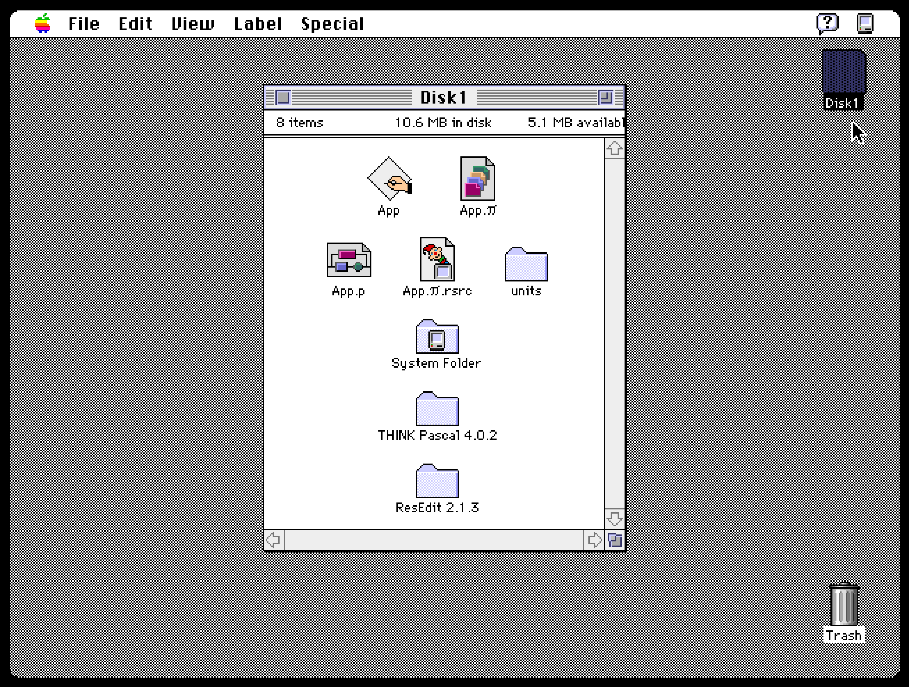

# classic-macintosh-think-pascal-starter-app
A disk image (`Disk1.dsk`) containing the source code for creating an old-school, classic Macintosh application in THINK Pascal 4.

### Instructions For Use

To view the Pascal source code, and to compile and run the classic Macintosh starter application, you will need to run a 680x0 Macintosh emulator such as [__Mini vMac__](https://www.gryphel.com/c/minivmac/).

Once you have your emulator up and running, open the disk image (`Disk1.dsk`) provided in this repo within your emulator and you'll find the THINK Pascal project file with all the source code, along with a pre-compiled version of the starter app.

If you are using [__Mini vMac__](https://www.gryphel.com/c/minivmac/), you can simply put the `Disk1.dsk` image in the same folder that your [__Mini vMac__](https://www.gryphel.com/c/minivmac/) emulator is located, and it should boot from that disk when you start the emulator. ([__Mini vMac__](https://www.gryphel.com/c/minivmac/) will automatically mount any disk images it finds, named `Disk1.dsk`, `Disk2.dsk`, `Disk2.dsk`, etc, in the order they are numbered.) The disk image includes System 7.1.

- Double-click the pre-compiled `App` application on the disk image to see the starter app running.

- Double-click the `App.π` project file to open THINK Pascal and to view and compile the source code.
